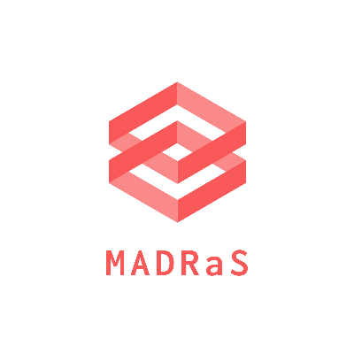

<h3 align="left"></h3>

# Description
MADRaS is a Multi-Agent Autonomous Driving Simulator built on top of TORCS. The simulator can be used to test autonomous vehicle algorithms both heuristic and learning based on an inherently multi agent setting.

For further information regarding running and installation please checkout our [Wiki](https://github.com/madras-simulator/MADRaS/wiki)
 
## Maintainers
 - [Sohan Rudra](https://github.com/rudrasohan)
 - [Anirban Santara](https://github.com/Santara)
 - [Meha Kaushik](https://github.com/MehaKaushik)
 
 ## Credits
 
 ### Developers:
 - [Abhishek Naik](https://github.com/abhisheknaik96)
 - [Sohan Rudra](https://github.com/rudrasohan)
 - [Meha Kaushik](https://github.com/MehaKaushik)
 - [Buridi Aditya](https://github.com/buridiaditya)
 - [Srijan Bansal](https://github.com/Srijanb97)
 
 ### Project Manager:
 - [Anirban Santara](https://github.com/Santara)
 
 ### Mentors:
 - [Bharat Kaul](https://ai.intel.com/bio/bharat-kaul/)
 - [Balaraman Ravindran](https://www.cse.iitm.ac.in/~ravi/) 
